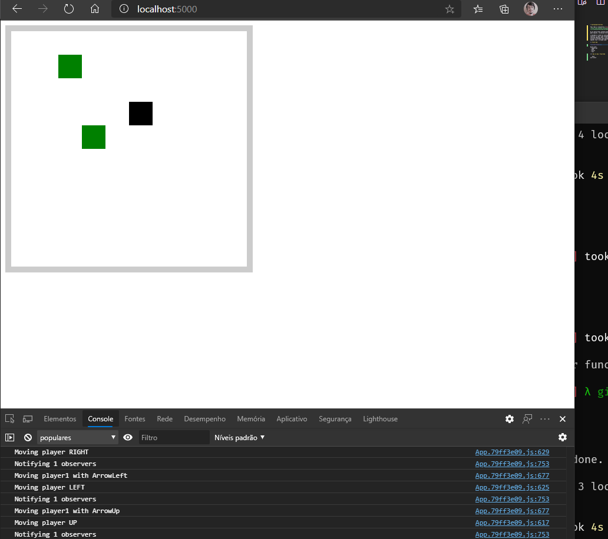

# multiplayer-do-telo

This repo is inspired by [Filipe Deschamps tutorial series](https://www.youtube.com/playlist?list=PLMdYygf53DP5SVQQrkKCVWDS0TwYLVitL).


# Motivations

As an entry-level software developer, I have tried so many game engines, including [Scratch](https://scratch.mit.edu/), [Unity](https://unity.com/), and [Unreal Engine](https://www.unrealengine.com/).

I decided to create an alternative version from his tutorial to learn some foundations of software development.

I started to apply what I learned from TypeScript, recreating some design choices of previous game engines that I already used.

## Front End



Build with:

- TypeScript
- SCSS
- Parcel
- Yarn

### How to Run:

```bash
$ cd frontend/
$ yarn watch
```
